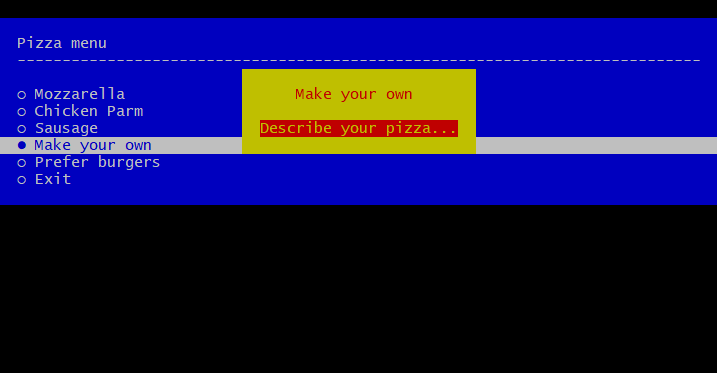
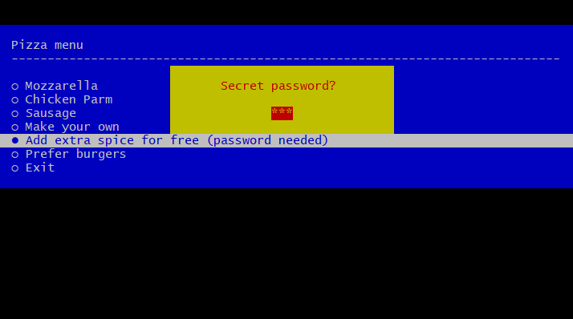

# Yii2 Console Menu

[](https://packagist.org/packages/vxm/yii2-console-menu)
[](https://packagist.org/packages/vxm/yii2-console-menu)
[](https://travis-ci.org/vuongxuongminh/yii2-console-menu)
[](https://scrutinizer-ci.com/g/vuongxuongminh/yii2-console-menu/?branch=master)
[](https://scrutinizer-ci.com/g/vuongxuongminh/yii2-console-menu/?branch=master)
[](http://www.yiiframework.com/)

## About it

An extension support build pretty menu base on [nunomaduro/laravel-console-menu](https://github.com/nunomaduro/laravel-console-menu), and is a [php-school/cli-menu](https://github.com/php-school/cli-menu) wrapper for Yii2 console controller.

## Requirements

* [PHP >= 7.1](http://php.net)
* [yiisoft/yii2 >= 2.0.13](https://github.com/yiisoft/yii2)

## Installation

Require Yii2 console menu using [Composer](https://getcomposer.org):

```bash
composer require vxm/yii2-console-menu
```

## Usage

### Quick Setup

<p align="center">
    
</p>

```php

use yii\console\Controller;

/**
 * @method \vxm\consoleMenu\Menu menu(string $title = '', array $options = [])
*/
class TestController extends Controller
{
    /**
     * Execute the action.
     *
     * @return void
     */
    public function actionTest()
    {
        $option = $this->menu('Pizza menu', [
            'Freshly baked muffins',
            'Freshly baked croissants',
            'Turnovers, crumb cake, cinnamon buns, scones',
        ])->open();

        $this->stdout("You have chosen the option number #$option");
    }
}
```

### Setup with a question

<p align="center">
    
</p>

```php

use yii\console\Controller;

/**
 * @method \vxm\consoleMenu\Menu menu(string $title = '', array $options = [])
*/
class TestController extends Controller
{
    /**
     * Execute the action.
     *
     * @return void
     */
    public function actionTest()
    {
        $option = $this->menu('Pizza menu')
                    ->addOption('mozzarella', 'Mozzarella')
                    ->addOption('chicken_parm', 'Chicken Parm')
                    ->addOption('sausage', 'Sausage')
                    ->addQuestion('Make your own', 'Describe your pizza...')
                    ->addOption('burger', 'Prefer burgers')
                    ->setWidth(80)
                    ->open();
        
        $this->stdout("You have chosen the text option: $option");
    }
}
```


### Setup with advanced option, in this case, a password

<p align="center">
    
</p>

```php

use yii\console\Controller;

/**
 * @method \vxm\consoleMenu\Menu menu(string $title = '', array $options = [])
*/
class TestController extends Controller
{
    /**
     * Execute the action.
     *
     * @return void
     */
    public function actionTest()
    {
        $menu = $this->menu('Pizza menu')
                    ->addOption('mozzarella', 'Mozzarella')
                    ->addOption('chicken_parm', 'Chicken Parm')
                    ->addOption('sausage', 'Sausage')
                    ->addQuestion('Make your own', 'Describe your pizza...');
        
        $itemCallable = function (\PhpSchool\CliMenu\CliMenu $cliMenu) use ($menu) {
            $cliMenu->askPassword()
                ->setValidator(function ($password) {
                    return $password === 'secret';
                })
                ->setPromptText('Secret password?')
                ->ask();

            $menu->setResult('Free spice!');

            $cliMenu->close();
        };
        $menu->addItem('Add extra spice for free (password needed)', $itemCallable);


        $option = $menu->addOption('burger', 'Prefer burgers')
            ->setWidth(80)
            ->open();

        $this->stdout("You have chosen the text option: $option");
    }
}
```


### Appearance

Available colors: `black`, `red`, `green`, `yellow`, `blue`, `magenta`, `cyan`, `white`.

```php
  $this->menu($title, $options)
      ->setForegroundColour('green')
      ->setBackgroundColour('black')
      ->setWidth(200)
      ->setPadding(10)
      ->setMargin(5)
      ->setExitButtonText("Abort") // remove exit button with ->disableDefaultItems()
      ->setUnselectedMarker('❅')
      ->setSelectedMarker('✏')
      ->setTitleSeparator('*-')
      ->addLineBreak('<3', 2)
      ->addStaticItem('AREA 2')
      ->open();
```

Check out the full documentation [here](https://github.com/php-school/cli-menu/blob/master/README.md).
